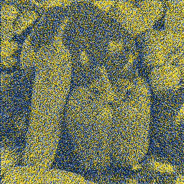
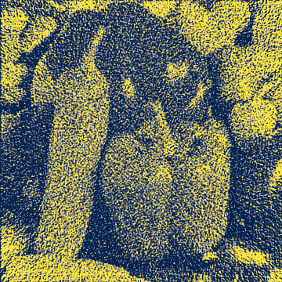
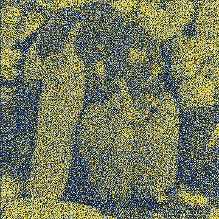

# Welcome to the TomoPy benchmarking repository

## Introduction

This website contains all of the benchmarking data for the latest stable version of TomoPy. If you are interested in older versions, go to the [tomopy.github.io](https://github.com/tomopy/tomopy.github.io) repository. 

These benchmarks are designed to give the reader the information they need to make an informed decision about which of TomoPy's reconstruction algorithms are right for their particular project. To accomplish that, these benchmarks contain results pertaining to the quality and speed of each reconstruction algorithm as well as the types of artifacts that may occur when using each of the algorithms. 

## Results
To see how the iterative reconstruction algorithms improve with each iteration, you see the [summary graph](https://github.com/tomopy/tomopy.github.io/blob/main/2021-02-19/cpu/peppers/summary.svg) after each benchmark. To quantitatively measure quality, we use the multi-scale structural similarity index (MS-SSIM) because it has been shown to have a stronger correlation to human perceptions of quality than simpler quality measures like the mean-squared error. The MS-SSIM measures the similarity between two images. In this case, it measures the reconstructed image against the original image shown above. The index has a range from 0 to 1, with 1 meaning images are identical and 0 meaning the images have no similarity. Because it would be impossible for the reconstructed image to perfectly match the original image, a perfect score of 1 is unattainable and, at best, an algorithm will asymptotically approach 1 as it performs more iterations. 

### Summary
The following graph shows how the MS-SSIM index improves over-time for the CPU algorithms. 

### Reconstructed Images

The below table showcases the evolution of reconstructed image given by the iterative algorithms.

|Algorithm | Iteration 1 (1st point)| Iteration 18 (7th point)| Iteration 95 (11th point)| Iteration 218 (13th point)| Iteration 499 (15th point)|
| --------------- | --------------- | --------------- | --------------- | --------------- | --------------- |
|ART||||||
|BART||||||
|MLEM||||||
|OSEM||||||
|OSPML Hybrid||||||
|OSPML Quad||||||
|PML Hybrid||||||
|PML Quad||||||
|SIRT||||||
|SIRT GPU||||||

|Filter -> | Butterworth | Cosine | Hamming | Hann | Parzen | Ramlak | Shepp |
| --------------- | --------------- | --------------- | --------------- | --------------- | --------------- | --------------- | --------------- |
|GRIDREC||||||||
## Limitations

While they are able to account for some artifacts, these benchmarks currently do not account for the possibility of several classes of artifacts that may occur in realistic conditions.

### Included artifacts
- Physics-based artifacts:
  - Noise: When there are statistical flucuations in the number of photons aborbed by a detector, the reconstructed image will have pixels that experienced an unwanted change in their value. This gives the image an appearance of graininess. These benchmarks simulate this artifact by adding poisson noise to the generated projections.

### Excluded artifacts
- Sample-based artifacts: 
  - Motion artifacts: If part of the sample moves during data collection, there can be blurriness in the reconstruction.
  - Out of field artifact: Dark streaks can appear when part of the sample is outside the field-of-view of the detector.
- Physics-based artifacts
  - Beam hardening: If an X-ray is polychromatic, materials with a high atomic number can absorb the low-energy X-rays more than the high-energy X-rays.
  - Photon starvation: When there are regions of relatively high attenuation in a sample, dark streaks can form as a result of few photons reaching the detector. 
- Hardware-based artifacts:
  - Ring artifact: If a detector is improperly calibrated or otherwise faulty, a faint ring will appear in the reconstruction.

## Data generation

The data is generated using the routines provided by the [turbo-couscous](https://github.com/tomopy/turbo-couscous) repository. 

## Organization

The benchmarking data is organized as follows:

- date
    - peppers
      - gridrec
      - mlem
      - osem
      - ospml_hybrid
      - osmpl_quad
      - pml_hybrid
      - sirt
      - sirt_gpu
      - summary

